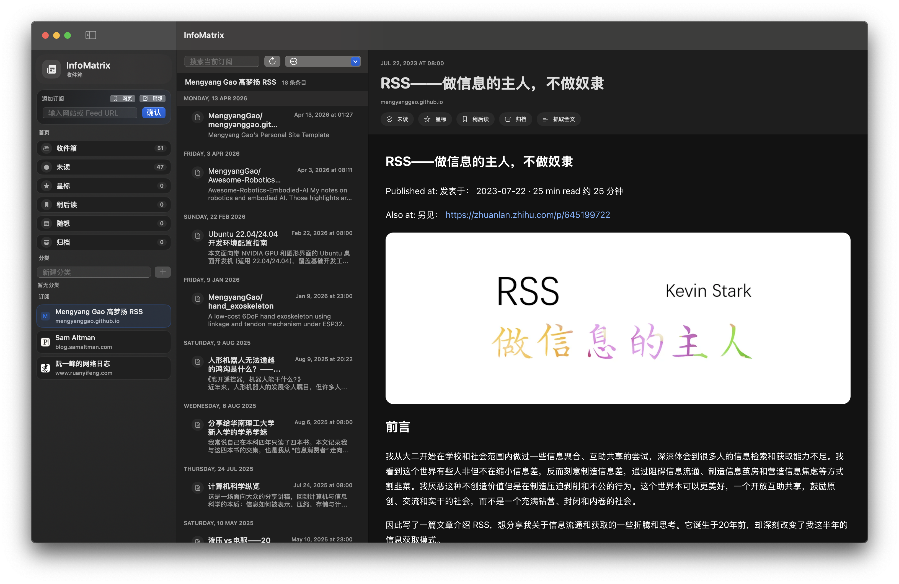

# InfoMatrix

<p align="center">
  
  
  
  
  
</p>

<p align="center">
  RSS, read-it-later, and memos in one reader.
</p>

<p align="center">
  
</p>

InfoMatrix is a cross-platform information aggregator built around three workflows:

- follow RSS, Atom, and JSON feeds
- save webpages and articles for later
- capture quick memos without leaving the reader

Rust owns discovery, parsing, fetching, persistence, refresh scheduling, and notification policy.
`app_core` is the shared orchestration layer for both shells.
SwiftUI provides the Apple shell through a native `InfoMatrixCore.xcframework` built from the Rust FFI bridge.
Flutter powers the Windows, Linux, and Android shell through the same Rust core contract.

## Download Releases

Pre-built release artifacts are published through GitHub Releases:

- [InfoMatrix Releases](https://github.com/MengyangGao/infoMatrix/releases)
- macOS users can also install through Homebrew:
  - `brew tap MengyangGao/infomatrix https://github.com/MengyangGao/infoMatrix`
  - `brew install --cask infomatrix`

Recommended packages by platform:

- macOS: `InfoMatrix-macos.dmg` for normal installation, or `InfoMatrix-macos.zip` for manual distribution
- Windows: `InfoMatrix-windows-x64.msix` for normal installation, or `InfoMatrix-windows-x64.zip` for manual unpacking
- Linux: `InfoMatrix-linux-x64.deb`
- Android: `InfoMatrix-android.apk` for direct install, or `InfoMatrix-android.aab` for Play-style distribution
- iOS simulator: `InfoMatrix-iOS-simulator.zip`

When signing assets are available, the release workflow also publishes installable Apple device artifacts. The release page includes the checksum files for every platform bundle.

## What You Can Do

- Subscribe to feeds by pasting a feed URL or a website URL.
- Discover feeds from websites when multiple candidates exist.
- Import and export subscriptions with OPML.
- Read in a three-pane layout: inbox, item list, and detail view.
- Search across the current inbox and feed scopes.
- Mark items read, starred, later, or archived.
- Save a webpage directly into read-it-later, then review it later as a regular item.
- Create a memo in a fast note composer.
- Configure per-feed notifications, digest delivery, quiet hours, and priority feeds.
- Let background refresh keep selected feeds current.
- Pull full text on demand when an item needs a better reading view.

## Features

### RSS Reader

- direct feed subscription
- website discovery and candidate selection
- OPML import/export
- feed grouping
- read/star/later/archive states
- full-text extraction for article detail
- background refresh with deterministic fetch behavior

### Read It Later

- paste a webpage or article URL
- save the page into the later queue
- attach an optional title or note
- revisit the saved page from the same inbox flow as feeds

### Memos

- quick note composer for short thoughts
- title + body entry flow
- memo items appear alongside the rest of the inbox

### Notifications

- per-feed notification settings
- immediate or digest delivery
- quiet hours
- high-priority feeds
- keyword include/exclude filters
- durable pending/delivered/suppressed state

## Run Locally

### macOS App

Build or refresh the Apple XCFramework first when the Rust core changes:

```bash
tooling/scripts/build_apple_xcframework.sh
```

Open `apps/apple/XcodeGen/InfoMatrix.xcodeproj` in Xcode, select the `InfoMatrix-macOS` scheme, and run.

Or use a single command:

```bash
tooling/scripts/run_macos_app.sh
```

To build a packaged app bundle:

```bash
tooling/scripts/package_macos_app.sh
open dist/InfoMatrix.app
```

For a full local release-style check:

```bash
tooling/scripts/release_check.sh
```

## Screenshots

Apple shell:


The Flutter shell shares the same Rust core contract on Windows, Linux, and Android. Platform-specific screenshots will be added as those release builds are captured.

## Release Readiness

- Core behavior is covered by Rust workspace tests.
- Apple and Flutter shells should stay aligned to the same Rust-backed service contracts.
- Release notes, target notes, and packaging details live in `docs/` and the app-specific README files.
- Before shipping, run the workspace tests and the relevant platform smoke checks for the target shell.
