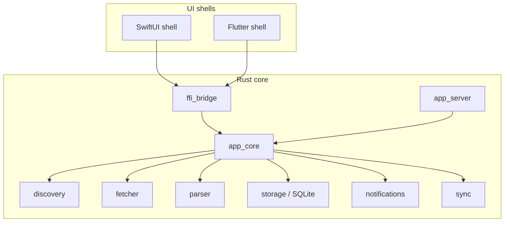

# InfoMatrix Architecture

## Goals

InfoMatrix is designed as a local-first RSS reader where parsing, fetching, persistence, and state transitions are deterministic and inspectable.

## Product Direction

InfoMatrix aims for a fast direct-feed workflow, inspectable behavior, strong local-account semantics, polished reading flow, and durable saved-item ergonomics.

Historical design inspiration and acknowledgements are summarized in the project README.

## Why Rust Core

The shared Rust core provides:

- deterministic feed discovery, fetching, and parsing behavior
- explicit data normalization and deduplication logic
- high-performance and memory-safe parsing for large feeds
- portable SQLite integration across Apple and Flutter shells
- a sync-ready event model from day one
- a dedicated notification and refresh foundation that keeps scheduling, policy, delivery, and audit state separate from UI shells

## Why SwiftUI for Apple Platforms

SwiftUI provides the most direct path to first-class macOS, iOS, and iPadOS support.

- native multi-column navigation and input patterns
- direct support for Apple accessibility stacks

## Why Flutter for Windows/Linux/Android

Flutter provides a mature and productive UI path for non-Apple platforms:

- strong desktop and mobile rendering parity
- responsive UI primitives and list virtualization
- practical host bindings for integrating the Rust core

## Layering

### Rust Core (`core/crates/*`)

- `discovery`: site URL normalization and feed discovery pipeline
- `parser`: RSS/Atom/JSON Feed parsing and normalization
- `fetcher`: conditional HTTP fetch logic and refresh policy
- `storage`: SQLite schema, migrations, and persistence APIs
- `notifications`: refresh scheduling, notification policy, delivery abstractions, audit helpers, and future push bridge interfaces
- `icon`: icon candidate selection/fetch/caching pipeline
- `opml`: import/export of subscriptions
- `sync`: sync event model and adapter interfaces
- `app_core`: shared orchestration façade for discovery, subscription, listing, entry creation, state mutations, and refresh coordination
- `app_server`: local HTTP façade for debug tooling and service-style integrations, built on top of `app_core`
- `ffi_bridge`: C ABI JSON bridge used by Flutter and the Apple native bridge, built on top of `app_core`

### UI Shells

- `apps/apple`: SwiftUI application shell for macOS/iOS/iPadOS, integrated through a native `InfoMatrixCore.xcframework` generated from `ffi_bridge`
- `apps/flutter`: Flutter shell for Windows/Linux/Android, currently integrated via `ffi_bridge`
- `visionOS` remains follow-up work because the current Apple XCFramework only ships macOS and iOS slices
- Item selection in the shell should stay lightweight: load local item detail first, and keep full-text extraction as an explicit user action so state mutations and sidebar refreshes do not depend on external page fetches.
- Notification permission handling and local delivery belong in the shell layer, but refresh orchestration, deduplication, policy evaluation, and durable audit state stay in Rust.

### Shared Presentation Contract

Both shells should render from the same screen-state contract instead of duplicating view logic around raw backend rows.

- `ReaderScreenState` describes the current inbox/list/detail shell state.
- `ReaderSidebarSectionState`, `ReaderSidebarRowState`, and `ReaderDetailPaneState` describe the visible presentation slots.
- `ActionDescriptor`, `LoadingState`, and `ErrorState` keep interaction and status metadata explicit.
- Domain models stay in Rust and shell-specific formatting stays in the shell, but the shape of a screen should be shared so future UI changes land in one contract first.

### Runtime Refresh Loop

- `app_server` starts a background refresh loop that periodically refreshes due feeds using the same storage and fetch path as the manual refresh APIs.
- The interval and batch size are configurable with environment variables so the loop stays inspectable and easy to disable or tune in development.
- Network-facing URL inputs in server/FFI flows are restricted to `http`/`https` schemes to keep fetch/discovery behavior web-only and explicit.
- SQLite schema migration is performed at server startup; request handlers reuse the migrated schema without re-running migration logic per request.
- The shared `app_core` layer centralizes common subscription, listing, detail, entry creation, and state mutation behavior so both UI shells stay aligned.
- Search queries for feed-scoped and global inbox-scoped item lists are routed through the same `app_core` façade so both shells share the same FTS-backed semantics.
- Subscription handlers persist the first parsed direct-feed snapshot during subscribe so the initial items appear without a second refresh round-trip.
- Discovery results are cached locally with a bounded TTL so a later feed subscription can reuse the validated parse result instead of refetching stale feed bodies.
- Feed icon caching runs asynchronously so it does not block subscription completion or feed refresh responses.

## Notifications and Refresh Foundation

InfoMatrix now separates background refresh from notification policy and delivery:

- `notifications::scheduler` computes refresh backoff, retry, and next-run state in a deterministic way.
- `notifications::policy` decides whether a candidate should be sent immediately, queued for digest delivery, or suppressed.
- `notifications::coordinator` turns parsed feed items into notification-ready drafts and digest batches.
- `notifications::delivery` defines a local delivery abstraction and a no-op fallback for non-notification builds.
- `notifications::bridge` defines a future remote push bridge interface without forcing a cloud dependency.
- `notifications::audit` provides durable reasons and timestamps for sent, queued, and suppressed decisions.

At the core boundary, `app_server` and `ffi_bridge` expose feed-level notification settings, global defaults, a pending notification queue, and acknowledgement endpoints. The Apple shell owns permission prompting and local notification delivery, but it does not own deduplication or policy evaluation.

Current behavior is intentionally local-first:

- background refresh can run on launch and on a periodic schedule
- per-feed notification policies are stored in SQLite
- notification events are persisted before delivery so the audit trail survives restarts
- delivery is opt-in per feed and can be disabled globally
- the future hosted push path can be added by implementing the bridge interface without rewriting the core model

## Sync Placement

Sync is treated as an architecture boundary rather than an MVP feature toggle:

- all key writes map to local events
- state mutation records use explicit timestamps
- adapters can target local-only, self-hosted, third-party, and Apple CloudKit sync systems without rewriting core models
- the local event queue is inspectable and ackable via explicit APIs (`/api/v1/sync/events*`)
- the Apple shell currently owns the first remote adapter, while non-Apple shells remain local-only

## Refresh and Icon Pipeline

Refresh scheduling is now explicit in SQLite:

- each feed stores `last_fetch_at`, `last_success_at`, `last_http_status`, `failure_count`, `next_scheduled_fetch_at`, `avg_response_time_ms`, and `health_state`
- `storage::list_due_feeds` returns feeds ready for background refresh
- `app_server` exposes `GET /api/v1/feeds/due` and `POST /api/v1/refresh/due`
- successful refreshes reschedule the feed; repeated failures back off with a bounded exponential policy

Icon handling is also local-first:

- the `icon` crate ranks candidate icons deterministically
- `app_server` fetches candidate assets, validates them, writes cached files to disk, and persists metadata in SQLite
- favicon fallback is cached when no better candidate is available

## Distribution Boundary

The public release pipeline is intentionally separate from runtime architecture:

- GitHub Releases is the user-facing distribution point.
- The release workflow packages macOS, iOS simulator/device, Windows, Linux, and Android artifacts from the same Rust-backed core.
- Documentation should name the actual downloadable bundles instead of implying a separate installer service.
